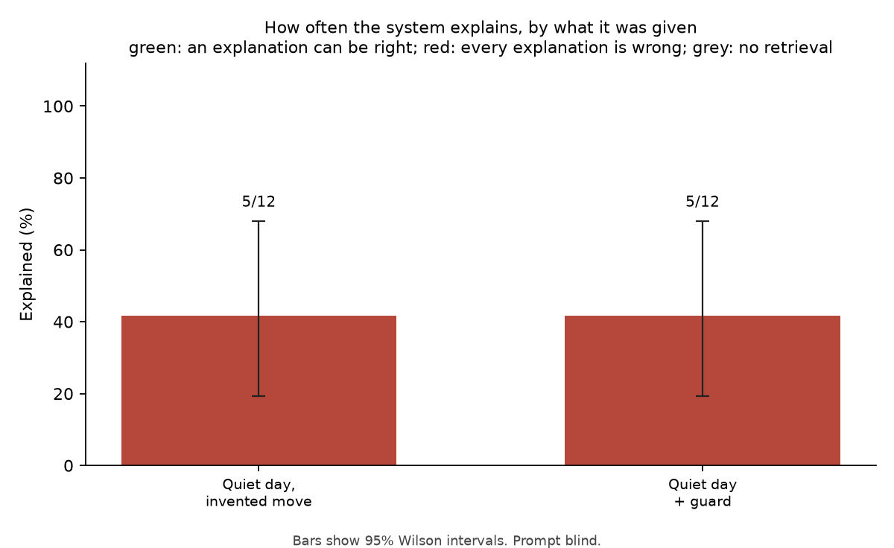

# Robustness Evaluation

How often the system explains a move, under conditions where explaining is and is not the right answer. Each condition changes one thing about a normal run; everything goes through the same code path as the CLI.

12 trials (0 faults, excluded from rates). Real anomaly dates: 73. Quiet placebo days: 12. Retrieval for real dates: live. Seed 7.
Models that answered: openai/gpt-oss-120b (12).

## Blind-evidence rule

The model reads the recent documents without being told the move, and a fixed rule decides (src/rag/blind_evidence.py). No direction guard is applied on this path, so the two columns are the same.

| Condition | Right answer | Explained: model alone | Explained: with direction guard |
|---|---|---|---|
| Quiet day, real news, invented move | refuse | 41.7% (5/12; 95% CI 19.3-68.0%) | 41.7% (5/12; 95% CI 19.3-68.0%) |

**False-explanation rate.** On quiet days with an invented move the system explained 41.7% (5/12; 95% CI 19.3-68.0%). Nothing happened on those days, so every one of these is an explanation of a move that did not take place. The relevance filter passed 100.0% (12/12; 95% CI 75.7-100.0%) of them.

What it built them from, for a person to read:

| Quiet day | Invented move | What the system said |
|---|---|---|
| 2018-11-19 | -4.8% day-over-day move (z-score -2.23) | The -4.8% day-over-day move (z-score -2.23) on 2018-11-19 is matched by 1 report published that day that gives a reason for prices falling: ajustes técnicos e oscilações do dólar (source: 29e7684ebe5d4f96). |
| 2019-08-27 | +4.6% day-over-day move (z-score 2.37) | The +4.6% day-over-day move (z-score 2.37) on 2019-08-27 is matched by 1 report published that day that gives a reason for prices rising: demanda e dólar (source: 7604f64b32722880). |
| 2020-08-24 | -5.8% day-over-day move (z-score -2.70) | The -5.8% day-over-day move (z-score -2.70) on 2020-08-24 is matched by 1 report published that day that gives a reason for prices falling: Fatores técnicos predominaram no dia (source: 1f6ed7cc0f0c4fa3). |
| 2021-08-20 | +4.3% day-over-day move (z-score 2.52) | The +4.3% day-over-day move (z-score 2.52) on 2021-08-20 is matched by 1 report published that day that gives a reason for prices rising: ajustes técnicos (source: 2c68d6f72ef9cdae). 1 report from the same day points the other way: ampla liquidação em commodities (source: f16ac1b386771aa9). |
| 2022-09-06 | +3.9% day-over-day move (z-score 2.45) | The +3.9% day-over-day move (z-score 2.45) on 2022-09-06 is matched by 2 reports published that day that give a reason for prices rising: Brazil counting its beans and low production causing supply shock (source: 7b9feffc6589a1ee); after hitting a six‑month high (source: 88f3f405555f174e). |

**The same readings under stricter rules.** No model is called again: each row re-applies the rule to the readings these trials stored. A stricter rule is worth adopting only if it explains fewer invented moves without explaining fewer real ones, and it has to be confirmed on days it was not chosen on (a different `--seed` draws other quiet days).

| Rule | Invented moves explained (right answer: none) |
|---|---|
| As the pipeline runs | 41.7% (5/12; 95% CI 19.3-68.0%) |
| Ignore reports of a move under a quarter the size of the claimed one | 41.7% (5/12; 95% CI 19.3-68.0%) |
| Only reports of a price move, not background events | 41.7% (5/12; 95% CI 19.3-68.0%) |
| Both of the last two | 41.7% (5/12; 95% CI 19.3-68.0%) |
| Only articles that cleared the relevance filter itself | 0.0% (0/12; 95% CI 0.0-24.3%) |

## Limits

- Sample sizes are small; every rate carries its 95% Wilson interval.
- A placebo day's news is whatever was retrievable for that window when this was run. Live retrieval is rate-limited and not perfectly repeatable; the retrieved evidence is cached so a re-report uses the same documents.
- An explanation on a real anomaly is counted as explained, not as correct. Whether it names the documented cause is for the side-by-side table and a human.
- The direction guard and prompt v2 were written after two should-refuse dates were found explained in earlier runs. The placebo days are dates those changes were not designed on. The flip and control conditions reuse the real anomaly dates, including those two, with inputs the changes were not designed on.
- The guard first withheld on a tie as well. That was dropped after it withheld three explanations on dates labelled as having a documented cause (1-1, 1-1 and 3-3 tallies), so the guard column is scored under the current rule: more accepted documents against the move than with it. Cached trials are re-scored, not re-run.
- The blind-evidence rule was written after the earlier runs had been read, and its two settings (recent means the same day or the two trading days before; the newest and most direct group of evidence decides) were fixed before any blind reading was run. The flip condition cannot be passed by tuning those settings: the reading is made without the direction, so the same documents cannot support both a rise and a fall.
- Gemini 3 models are run at their default temperature (Google advises against lowering it), so trials answered by one are not exactly repeatable.
